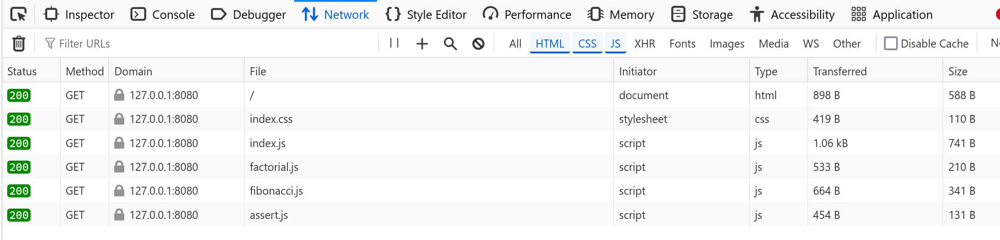

This is a simple static website that uses ES6 modules. You can use an npm package like [http-server](https://www.npmjs.com/package/http-server) to host a static web server locally to see it in action.

You can see the network trace where each module is fetched:

ES6 modules are cool because you don't need to use a bundler. The caveat is that each javascript module requires a separate network call to fetch the resource.

